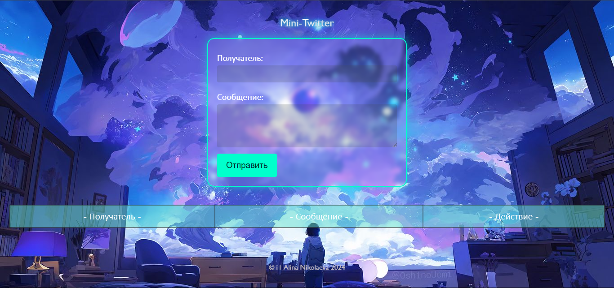
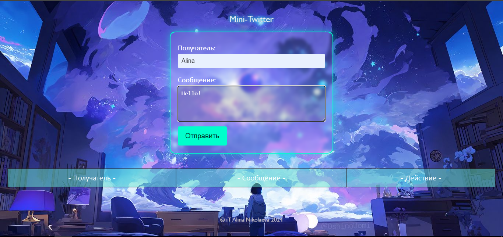

# Mini-Twitter

<h2>Описание</h2>

Mini-Twitter — это минималистичное веб-приложение для отправки и управления короткими сообщениями между пользователями. Интерфейс выполнен в футуристическом стиле с неоновыми элементами и аниме-фоном.

<h2>Функции</h2>
<ul>
    <li>Отправка сообщений определенному пользователю.</li>
    <li>Отображение списка отправленных сообщений.</li>
    <li>Удаление сообщений по клику на кнопку.</li>
</ul>

<h2>Интерфейс</h2>
<ul>
    <li><strong>Форма отправки сообщений</strong>: включает поля для имени получателя и ввода сообщения, а также кнопку отправки.</li>
    <li><strong>Таблица сообщений</strong>: содержит список отправленных сообщений с указанием получателя и кнопкой удаления.</li>
</ul>

<h2>Используемые технологии</h2>
<ul>
    <li>HTML</li>
    <li>CSS</li>
    <li>JavaScript</li>
</ul>

<h2>Как запустить</h2>
<ol>
    <li>Скачайте файлы проекта.</li>
    <li>Откройте <code>index.html</code> в браузере.</li>
    <li>Приложение готово к использованию!</li>
</ol>

<h2>Дополнительные возможности</h2>
<ul>
    <li>Неоновый стиль оформления с анимированным свечением.</li>
    <li>Легкость в использовании и минималистичный дизайн.</li>
    <li>Простая интеграция новых функций.</li>
</ul>

  

  

  

